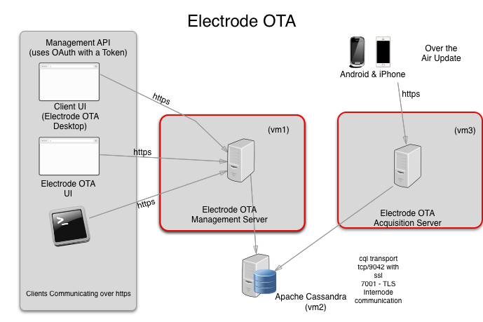

# Electrode OTA Server

The Electrode OTA Server provides a way to hot deploy android and ios React Native&#8482; and Cordova&#8482; apps. The server
is API compatible with [code-push-cli](https://microsoft.github.io/code-push/docs/cli.html), the
[Code Push React Native SDK](https://microsoft.github.io/code-push/docs/react-native.html) and the [Code Push Cordova SDK](https://microsoft.github.io/code-push/docs/cordova.html).

## Requirements

- Node ^6.6.0

## Upgrade

### Version 4.3.0

Various bug fixes.

### Version 4.0.0

Rewrite of mariadb module; simplify needed configuration to use the mariadb module.

```json
        "electrode-ota-server-dao-plugin" : {
            "module" : "electrode-ota-server-dao-mariadb",
            "options": {
                "clusterConfig" : {
                    "canRetry" : true,
                    "defaultSelector" : "ORDER",
                    "removeNodeErrorCount" : 5,
                    "restoreNodeTimeout" : 0,
                },
                "poolConfigs" : [{
                    "database": "electrode_ota",
                    "host": "localhost",
                    "password": "ota",
                    "port": 33060,
                    "user": "ota",
                }],
            }
        },
```

The underlying implementation uses the npm module [mysql](https://www.npmjs.com/package/mysql). The options are described in further detail in the module's [readme](./electrode-ota-server-dao-mariadb/README.md).

The schema for mariadb is in the [electrode-ota-mariadb-schema folder](./electrode-ota-mariadb-schema/README.md). The module does not use sequelize anymore, and the schema is created separately using liquibase.

### Version 3.2.1

Version 3.2.1 is deprecated. Please use Version 3.3.0 instead.

### Version 2

Version 2 adds partial update support. To do this it requires some alterations to the cassandra database. This
will happen automatically, unless the configuration to the electrode-ota-dao-cassandra is configured as

```json
 "electrode-ota-server-dao-cassandra": {
                "options": {
                    ...
                    "disableTTYConfirmation": false,
                    //this is alter by default.
                    "migration": "safe",
                }
            }
 }
```

Make sure to backup your data, while not known to cause data loss, it is possible.



## Installation

For configuration instructions visit the [electrode.io](http://www.electrode.io/docs/electrode_react_native_over_the_air_electron.html)

```
 npm i electrode-ota-server
```

## Upload Size and Timeout

To increase the max upload size, add this to your configuration:
Likewise, you can set the timeout if upload is timing out.

```json
"electrode-ota-server-routes-apps" : {
            options : {
                payload : {
                    maxBytes : 94371840,
                    timeout: 119999
                }
            }
        }
```

## Development

To run tests, make sure you have `localhost.walmart.com` mapped to 127.0.0.1 loopback.
Make sure you have cassandra installed. Cassandra is required for testings.

```sh
> docker pull cassandra
> docker run -p 9042:9042 cassandra
```

To build..

```
> npm install -g lerna yarn
> lerna bootstrap
```

To run all tests (will rebuilds all) ..

```
> yarn test
```

To run a package test...

```
> cd electrode-ota-model-app
> yarn test
```

To run a sample app, check the example app in the example folder.

Apache-2.0 © WalmartLabs
<br>
Built with :heart: by [Team Electrode](https://github.com/orgs/electrode-io/people) @WalmartLabs.
